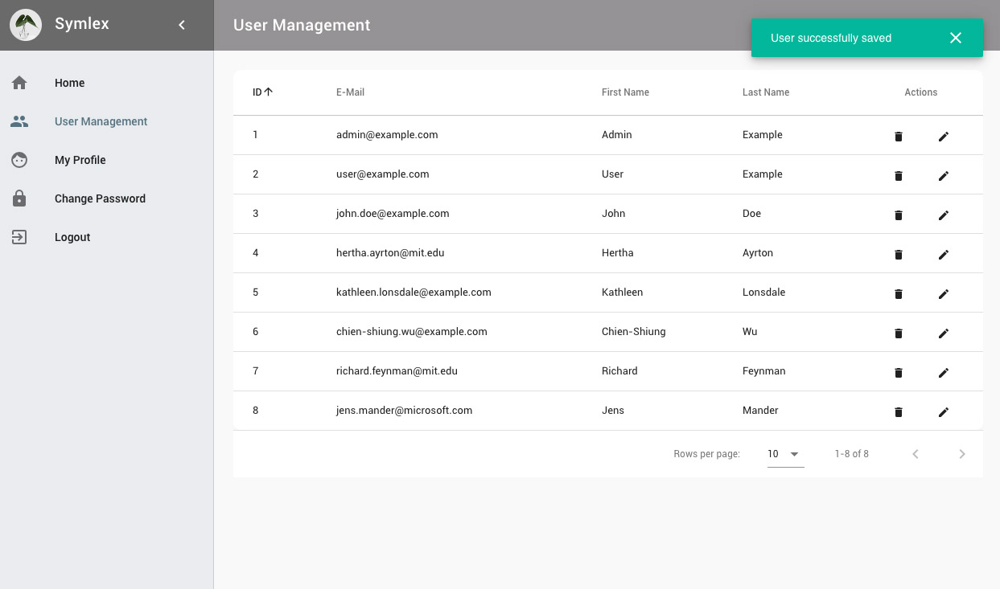

# Setup 

Before you start, make sure you have PHP 7, Composer and Docker installed on your system (short [howto](../osx.md) 
for Mac OS X users). Instead of using Docker, you can also setup your own runtime environment based on the existing 
[Docker configuration](https://github.com/symlex/symlex/tree/master/app/docker).

**Step 1:** Run [Composer](https://getcomposer.org/) to create a new Symlex project:

```
composer create-project symlex/symlex myapp
```

**Step 2:** Start nginx, PHP and MySQL using [Docker](https://www.docker.com/):

```
cd myapp
docker-compose up
```

!!! info
    This docker-compose configuration is for testing and development purposes only. On OS X, the current release of 
    Docker is [really slow](https://twitter.com/lastzero/status/829191426391027712) in executing PHP from the host's file system.

**Step 3:** Let [Phing](https://www.phing.info/) initialize the database and build the front-end components for you:

```
docker-compose exec php sh
bin/phing dev
```

!!! tip
    You can also use this approach to execute other commands later (see `build.xml`). Alternatively, you can 
    install npm and Yarn locally and link "db" to 127.0.0.1 in /etc/hosts to run them directly on your host.

After successful installation, open the site at http://localhost:8081/ and log in as `admin@example.com` using the 
password `passwd`. If you add `localhost-debug` to your /etc/hosts and access the site with that, it will load in debug
mode (you'll see a stack trace and other debug information on the error pages).

The [mailhog](https://github.com/ian-kent/MailHog) user interface is available at http://localhost:8082/. It can be used
to receive and view mails automatically sent by the system, e.g. when new users are created.

